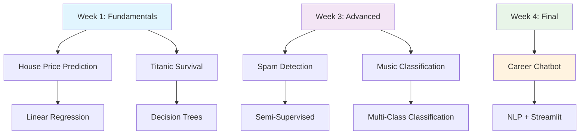

# 🚀 NextGen Learners Machine Learning Internship 2025

<div align="center">


### 🎓 **Mudasir Naeem** | Machine Learning Intern
**July 1, 2025 - July 31, 2025**

[](https://www.linkedin.com/in/mudasir-naeem-698679303/)
[](https://github.com/MudasirNaeem1)

</div>

---

## 📋 Table of Contents

- [🎯 About the Internship](#-about-the-internship)
- [📜 Official Documents](#-official-documents)
- [🗓️ Weekly Projects](#️-weekly-projects)
- [🛠️ Technologies Used](#️-technologies-used)
- [🏆 Key Achievements](#-key-achievements)
- [📊 Project Showcase](#-project-showcase)
- [🎓 Learning Outcomes](#-learning-outcomes)
- [📞 Contact](#-contact)

---

## 🎯 About the Internship

<div align="center">

> **"A comprehensive journey through Machine Learning fundamentals to advanced applications"**

</div>

This repository documents my **one-month intensive Machine Learning internship** at **NextGen Learners**, where I gained hands-on experience in:

- 🔍 **Supervised Learning** (Classification & Regression)
- 🔄 **Semi-Supervised Learning** techniques
- 🎵 **Audio Feature Analysis** for music classification
- 🤖 **Natural Language Processing** for chatbot development
- 📊 **Data Preprocessing** and **Feature Engineering**
- 🎯 **Model Evaluation** and **Performance Optimization**

---

## 📜 Official Documents

<div align="center">

### 📄 Internship Credentials

<table>
<tr>
<td align="center">
<h4>🎉 Offer Letter</h4>
<a href="https://github.com/MudasirNaeem1/NextGen-Learners-ML-Internship-2025/blob/main/NEXTGEN_OFFER_LETTER.pdf">

</a>
<br><br>
<em>Official internship selection confirmation</em>
</td>
<td align="center">
<h4>🏆 Certificate</h4>
<a href="https://github.com/MudasirNaeem1/NextGen-Learners-ML-Internship-2025/blob/main/Certificate_Mudasir_Naeem.pdf">

</a>
<br><br>
<em>Completion certificate with excellence remarks</em>
</td>
</tr>
</table>

</div>

---

## 🗓️ Weekly Projects

<details>
<summary><h3>📅 Week 1: Supervised Learning Fundamentals</h3></summary>

#### 🎯 **Objective**: Master Classification & Regression Basics

**🏠 Task 1: House Price Prediction (Regression)**
- **Dataset**: California Housing Dataset
- **Algorithm**: Linear Regression
- **Evaluation**: MSE, R² Score
- **Key Skills**: Feature analysis, model training, performance evaluation

**🚢 Task 2: Titanic Survival Prediction (Classification)**
- **Dataset**: Titanic Dataset
- **Algorithm**: Decision Tree Classifier
- **Evaluation**: Accuracy, Confusion Matrix
- **Key Skills**: Data cleaning, encoding, classification techniques

**🔧 Tools Used**: `pandas`, `numpy`, `matplotlib`, `scikit-learn`

</details>

<details>
<summary><h3>📅 Week 2: Advanced Techniques</h3></summary>

*Project details to be added based on Week 2 activities*

</details>

<details>
<summary><h3>📅 Week 3: Semi-Supervised Learning & Audio Analysis</h3></summary>

#### 🎯 **Objective**: Handle Limited Labeled Data & Audio Features

**📧 Task 1: Email Spam Detection (Semi-Supervised)**
- **Dataset**: SMS Spam Collection Dataset
- **Technique**: Label Spreading/Propagation
- **Challenge**: Only 20% labeled data available
- **Evaluation**: Precision, Recall, F1-Score
- **Key Skills**: Text preprocessing, TF-IDF, semi-supervised learning

**🎵 Task 2: Music Genre Classification**
- **Dataset**: Spotify Audio Features / GTZAN Dataset
- **Features**: Acousticness, Danceability, Energy, Tempo, Loudness
- **Algorithms**: Logistic Regression, Random Forest, KNN, Gradient Boosting
- **Key Skills**: Audio feature analysis, multi-class classification, EDA

**🔧 Advanced Tools**: `TfidfVectorizer`, `sklearn.semi_supervised`, Audio feature processing

</details>

<details>
<summary><h3>📅 Week 4: Final Project - Career Guidance Chatbot</h3></summary>

#### 🎯 **Objective**: Build Complete ML-Powered Application

**🤖 Career Guidance Chatbot**
- **Dataset**: 1,620+ rows, 54 career roles
- **Frontend**: Streamlit web interface
- **ML Component**: Intent classification model
- **Features**: Natural language understanding, career recommendations
- **Deliverables**: Working chatbot, trained model, documentation, demo video

**🏗️ Project Structure**:
```
career_chatbot_project/
├── app.py                    # Streamlit frontend
├── train_model.py           # Model training script
├── career_guidance_dataset.csv
├── intent_model.pkl         # Saved model
└── vectorizer.pkl          # TF-IDF vectorizer
```

**🔧 Technologies**: `Streamlit`, `NLP`, `Intent Classification`, `joblib/pickle`

</details>

---

## 🛠️ Technologies Used

<div align="center">

### Programming & Libraries


### Machine Learning Techniques
- **Supervised Learning**: Linear Regression, Decision Trees, Logistic Regression, Random Forest, KNN, SVM
- **Semi-Supervised Learning**: Label Spreading, Label Propagation
- **NLP**: Text Preprocessing, TF-IDF Vectorization, Intent Classification
- **Model Evaluation**: MSE, R², Accuracy, Precision, Recall, F1-Score, Confusion Matrix

</div>

---

## 🏆 Key Achievements

<div align="center">

| Achievement | Description | Impact |
|-------------|-------------|---------|
| 🎯 **100% Task Completion** | Successfully completed all 4 weeks of assignments | Demonstrated consistency and dedication |
| 📊 **Multi-Domain Expertise** | Worked across housing, transportation, communication, and music domains | Versatile problem-solving skills |
| 🤖 **End-to-End Application** | Built complete chatbot with ML backend and web frontend | Full-stack ML development experience |
| 📈 **Performance Excellence** | Achieved high accuracy scores across all classification tasks | Strong technical competence |
| 💡 **Innovation** | Applied semi-supervised learning to real-world spam detection | Advanced ML technique implementation |

</div>

---

## 📊 Project Showcase

<div align="center">

### 🎨 Interactive Project Gallery



### 📈 Learning Progression

| Week | Focus Area | Complexity Level | Key Skills Gained |
|------|------------|------------------|-------------------|
| 1️⃣ | **Fundamentals** | 🟢 Beginner | Data preprocessing, basic ML algorithms |
| 2️⃣ | **Intermediate** | 🟡 Intermediate | Advanced techniques, model optimization |
| 3️⃣ | **Advanced** | 🟠 Advanced | Semi-supervised learning, audio analysis |
| 4️⃣ | **Professional** | 🔴 Expert | Full-stack ML application development |

</div>

---

## 🎓 Learning Outcomes

<div align="center">

### 🧠 Technical Skills Mastered

</div>

**🔍 Data Science Pipeline**
- Data collection, cleaning, and preprocessing
- Exploratory Data Analysis (EDA) with visualizations
- Feature engineering and selection techniques
- Model training, validation, and testing

**🤖 Machine Learning Expertise**
- Supervised learning algorithms implementation
- Semi-supervised learning for limited labeled data
- Model evaluation and performance metrics
- Hyperparameter tuning and optimization

**💻 Software Development Skills**
- Python programming for data science
- Jupyter Notebook for interactive development
- Version control with Git and GitHub
- Web application development with Streamlit

**🎯 Domain Applications**
- Real estate price prediction
- Passenger safety analysis
- Spam detection systems
- Music genre classification
- Career guidance systems

---

## 📞 Contact

<div align="center">

### 🤝 Let's Connect!

[](https://www.linkedin.com/in/mudasir-naeem-698679303/)
[](https://github.com/MudasirNaeem1)
[](https://mail.google.com/mail/?view=cm&fs=1&to=mudasirnaeem000@gmail.com)

---
</div>

---

<div align="center">

### 🌟 **"Transforming theoretical knowledge into practical solutions"** 🌟

**Thank you for visiting my Machine Learning internship repository!**

⭐ **Star this repository if you found it helpful!** ⭐

---


</div>
